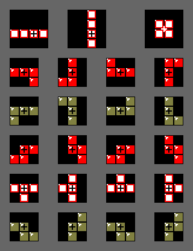

#How the Pieces Are Spawned and Manipulated in the Game

## Piece Entry
"Right-handed version was used in Tetris (NES, Nintendo) and Tetris & Dr. Mario. Tetrominoes spawn with their highest block on row 20." -Tetris wiki at 2016-11-9-11:00ish [link](http://tetris.wikia.com/wiki/Nintendo_Rotation_System) *Rotations diaigram also from here.*

Through experience with the game, it has been established that you can rotate pieces so that parts of the piece are above the screen, this is not a standard feature of all Tetris knockoffs. *Multiplayer Tetris **will** include this feature.*

## Rotations
Axis of rotation is marked with a black (or white for O piece) crosshairs.
###### Diagram of Rotations

